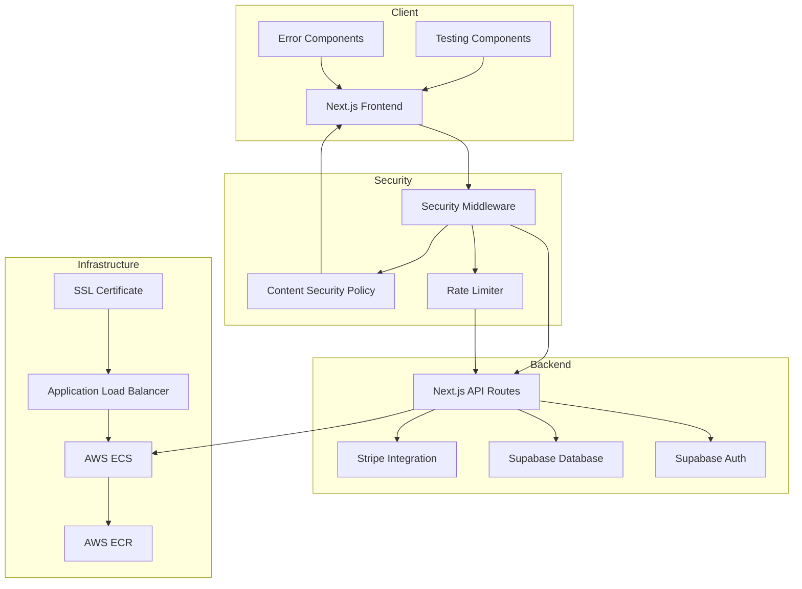
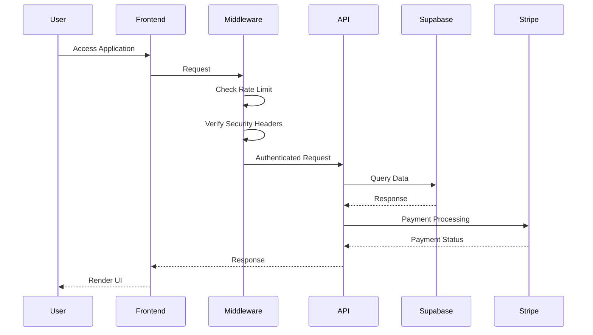
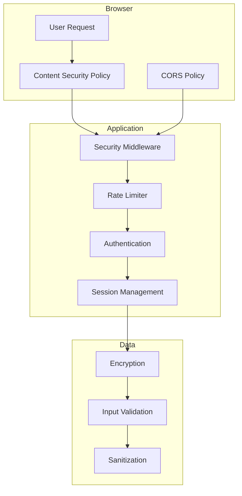
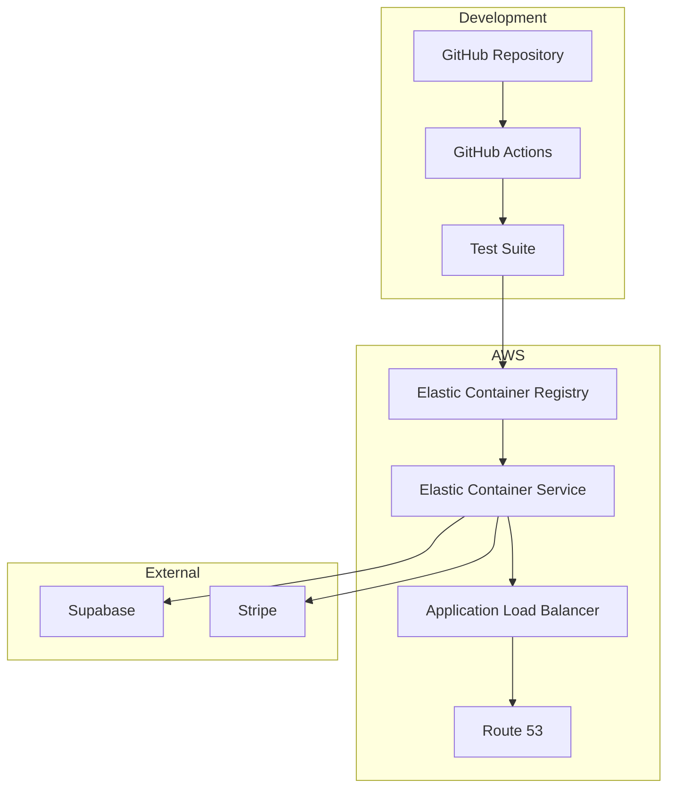

# Architecture Documentation

## System Architecture

```mermaid
graph TD
    subgraph Client
        UI[Next.js Frontend]
        EC[Error Components]
        TC[Testing Components]
    end

    subgraph Security
        MW[Security Middleware]
        RL[Rate Limiter]
        CSP[Content Security Policy]
    end

    subgraph Backend
        API[Next.js API Routes]
        AUTH[Supabase Auth]
        DB[Supabase Database]
        STRIPE[Stripe Integration]
    end

    subgraph Infrastructure
        ECS[AWS ECS]
        ECR[AWS ECR]
        ALB[Application Load Balancer]
        CERT[SSL Certificate]
    end

    UI --> MW
    MW --> API
    API --> AUTH
    API --> DB
    API --> STRIPE
    RL --> API
    CSP --> UI
    EC --> UI
    TC --> UI

    MW --> RL
    MW --> CSP

    API --> ECS
    ECS --> ECR
    ALB --> ECS
    CERT --> ALB
```

## Data Flow

```mermaid
sequenceDiagram
    participant User
    participant Frontend
    participant Middleware
    participant API
    participant Supabase
    participant Stripe

    User->>Frontend: Access Application
    Frontend->>Middleware: Request
    Middleware->>Middleware: Check Rate Limit
    Middleware->>Middleware: Verify Security Headers
    Middleware->>API: Authenticated Request
    API->>Supabase: Query Data
    Supabase-->>API: Response
    API->>Stripe: Payment Processing
    Stripe-->>API: Payment Status
    API-->>Frontend: Response
    Frontend-->>User: Render UI
```

## Security Architecture

```mermaid
graph TD
    subgraph Browser
        REQ[User Request]
        CSP[Content Security Policy]
        CORS[CORS Policy]
    end

    subgraph Application
        MW[Security Middleware]
        RL[Rate Limiter]
        AUTH[Authentication]
        SESS[Session Management]
    end

    subgraph Data
        ENC[Encryption]
        VALID[Input Validation]
        SAN[Sanitization]
    end

    REQ --> CSP
    CSP --> MW
    CORS --> MW
    MW --> RL
    RL --> AUTH
    AUTH --> SESS
    SESS --> ENC
    ENC --> VALID
    VALID --> SAN
```

## Deployment Architecture

```mermaid
graph TD
    subgraph Development
        GH[GitHub Repository]
        CI[GitHub Actions]
        TESTS[Test Suite]
    end

    subgraph AWS
        ECR[Elastic Container Registry]
        ECS[Elastic Container Service]
        ALB[Application Load Balancer]
        R53[Route 53]
    end

    subgraph External
        SUP[Supabase]
        STR[Stripe]
    end

    GH --> CI
    CI --> TESTS
    TESTS --> ECR
    ECR --> ECS
    ECS --> ALB
    ALB --> R53
    ECS --> SUP
    ECS --> STR
```
